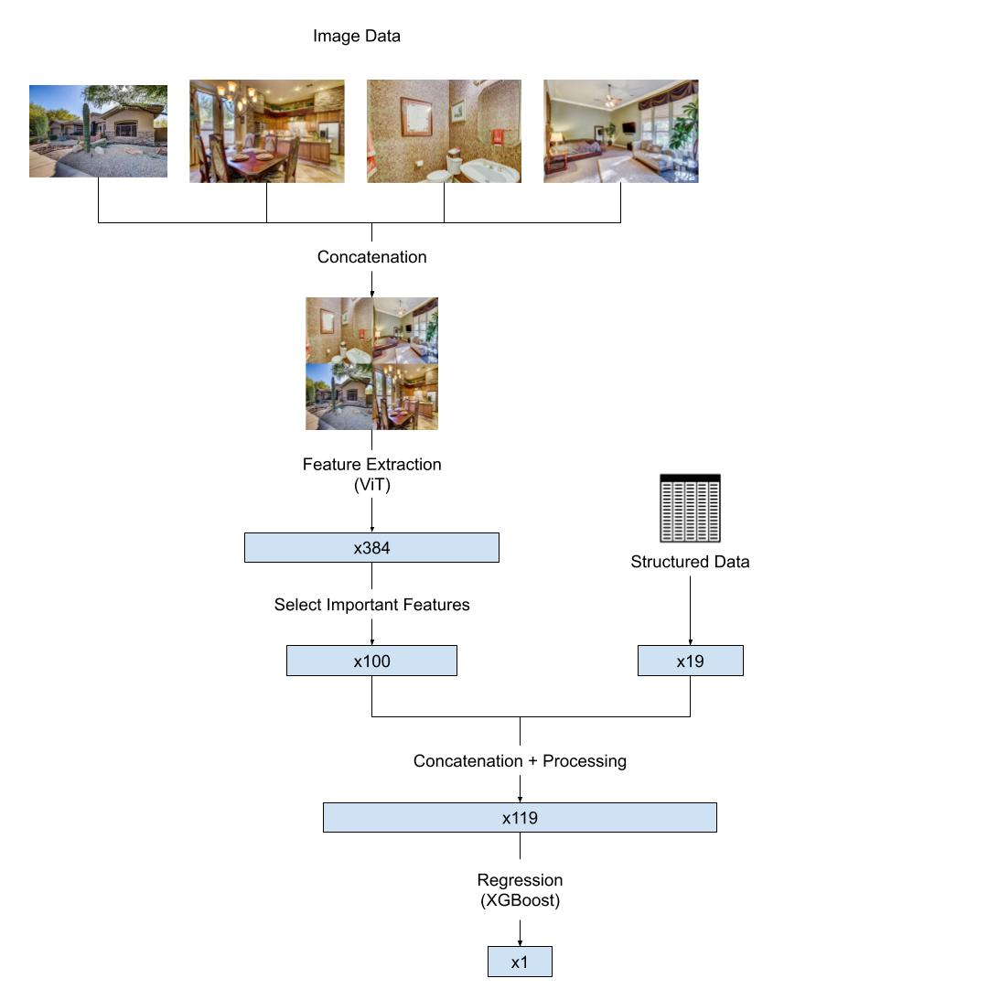
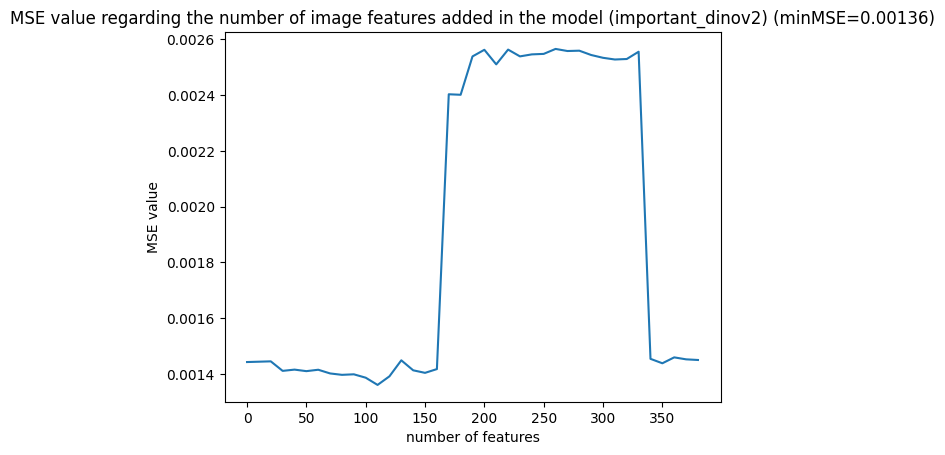
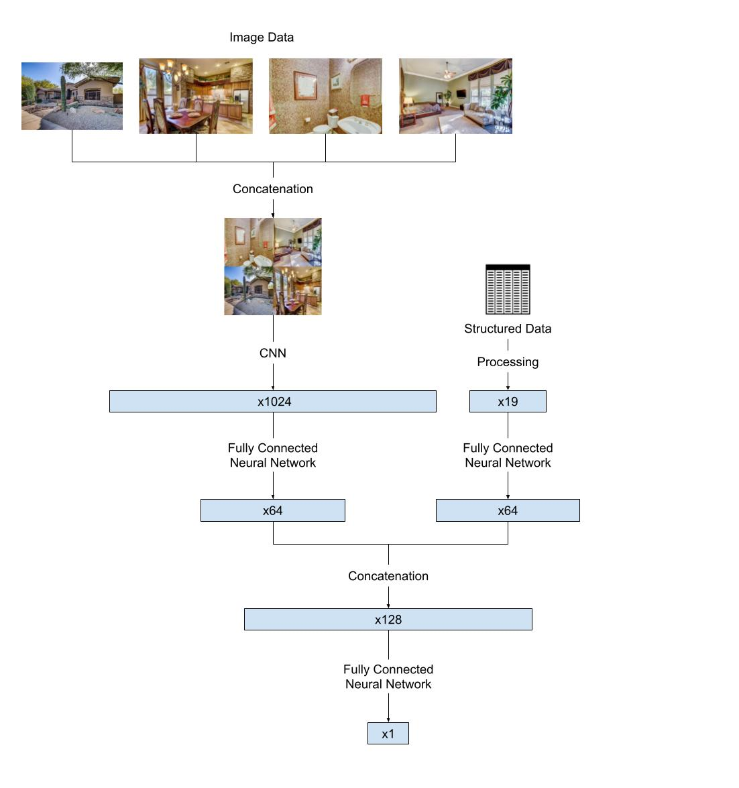

# House-pricing-ML

This repository is the result of personal work on developing a model capable of estimating the price of a house based on structured data and images of the house.

The model is trained on the following public dataset : https://github.com/emanhamed/Houses-dataset.git

## Quick Run

1. Setup the environnement

```bash
make setup
```

2. In the Makefile, specify the paths to the datasets. Choose a method (CNN_FCNN or ViT_XGboost). Specify if you want to augment the visual data.

```Makefile
path_image='./Houses-dataset/Houses Dataset'
path_struct_data='./Houses-dataset/Houses Dataset/HousesInfo.txt'
path_uszip_data='./data/uszips/uszips.csv'

method=CNN_FCNN #ViT_XGboost #CNN_FCNN

AUGM= #--augm
```

3. Run

```bash
mak run
```

4. Let the magic happen !

## Repository structure

The repository consists of two groups of files:

- **Notebooks** (`data_processing.ipynb`, `regression.ipynb`): where exploratory work is conducted.

- **Python scripts** (`main.py`, `methods.py`, `utils.py` : which contain the code executed when the `make run` command is launched.

## Learning Methods

After the exploratory work conducted in the notebooks, I decided to properly implement 2 methods:

### ViT_XGboost

ViT_XGboost is a concatenation of a vision transformer to extract the features of the images and a XGboost regressor to predict the price of the house.



- For feature extraction from images, I chose to use [DinoV2-small](<(https://arxiv.org/abs/2304.07193)>) because it is a very recent state-of-the-art model that has demonstrated excellent abilities in segmentation and categorization during benchmarks. Additionally, this model extracts only 384 features compared to 1024 for ResNet. Given the limited dataset size (535 examples), it is preferable to condense the information into as few features as possible.
- The feature is important if it is correlated to the target (Price). The ViT (DinoV2-small) extracts 384 features of an image. In the model we keep only the 100 most important.
- To determine the number of image features to keep, I have plot the performance (MSE) of the model output regarding the number of added features. On the graph below, we can see that the optimal is obtained in keeping approximately 110 variables.



### CNN_FCNN

CNN_FCNN is a concatenation of a Convolutional Neural Network to extract the features of the images and a Fully Connected Neural Networks to perform the regression.
The model is trained from scratch.

Due to the limited computing power of my computer, I was unable to properly optimize the hyperparameters of this model.

Here is the **artitecture of the model** :


